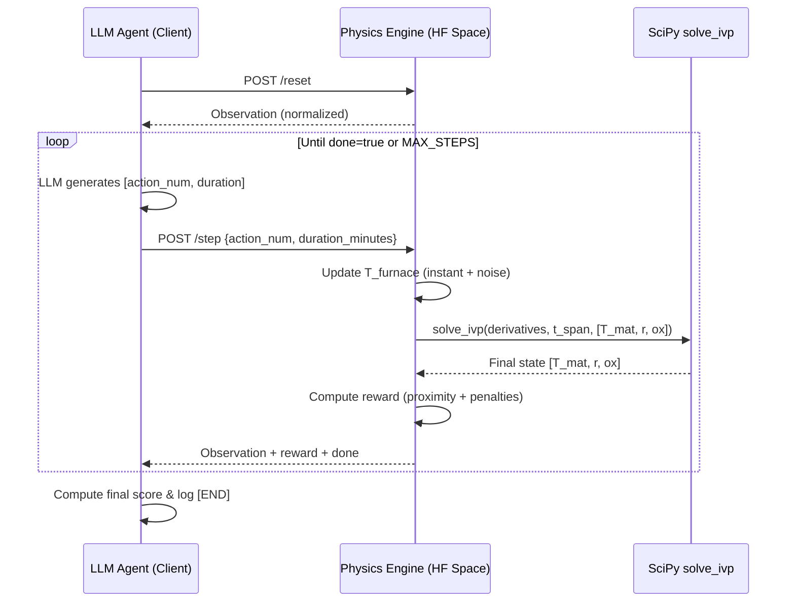

# 🏗️ System Architecture

This project splits the Reinforcement Learning pipeline into two distinct microservices to protect the physics engine from machine learning memory leaks and to mirror production industrial control systems.

---

## High-Level Topology

```text
┌──────────────────────────────────────────┐     WebSocket (WSS)     ┌─────────────────────────────────────────┐
│        ML Policy Optimizer (Client)      │  ───────────────────►  │       Physics Engine (Server)           │
│        HF Space (GPU Notebook)           │                        │       Hugging Face Space                │
│                                          │  ◄───────────────────  │                                        │
│  • Llama-3.2-1B (4-bit, Unsloth)         │   JSON Observation     │  • FastAPI + OpenEnv                   │
│  • GRPO via TRL                          │   + Reward Signal       │  • SciPy ODE solver (solve_ivp)        │
│  • WebSocket reward function (V6)        │                        │  • Task routing (easy/medium/hard)     │
└──────────────────────────────────────────┘                        └─────────────────────────────────────────┘
```

The ML client never simulates physics — it only parses LLM outputs, clamps them, and forwards actions over WebSocket. The server owns all thermodynamic truth.

> **Critical**: OpenEnv's HTTP `/reset` and `/step` endpoints are **stateless** — each call creates and destroys a fresh environment. For multi-step episodes (where temperature must accumulate), use the WebSocket `/ws` endpoint which maintains a persistent, stateful session per connection.

---

## 1. The Physics Engine (Server)

Hosted on a **Hugging Face Space** (Docker SDK), this acts as the digital twin.

| Aspect | Detail |
|--------|--------|
| **Framework** | Meta's [OpenEnv](https://github.com/meta-pytorch/OpenEnv) + FastAPI |
| **Core Engine** | [`server/heat_treatment_scheduler_environment.py`](../server/heat_treatment_scheduler_environment.py) — ODE-based physics simulation |
| **App Factory** | [`server/app.py`](../server/app.py) — `create_app()` auto-generates REST + WebSocket endpoints |
| **Routing** | Exposes `/reset`, `/step`, `/state`, `/schema`, and `/ws` endpoints |
| **ODE Solver** | SciPy `solve_ivp` with RK45, max step 120 s (evaluated every 2 minutes of sim-time) |
| **Validation** | Pydantic models enforce physical boundaries (e.g., `duration_minutes ∈ [1, 600]`, `action_num ∈ [0, 5]`) |
| **Concurrency** | `SUPPORTS_CONCURRENT_SESSIONS = True`; `max_concurrent_envs=8` in `app.py` (GRPO's `num_generations=4` requires 4 parallel WebSocket sessions; set to 8 for headroom) |

### Server Endpoints

| Method | Path | Description |
|--------|------|-------------|
| `POST` | `/reset` | Reset the environment (stateless — creates new env per call) |
| `POST` | `/step` | Execute an action (stateless — creates new env per call) |
| `GET` | `/state` | Return raw (unnormalized) environment state for UI/debugging |
| `GET` | `/schema` | Return JSON schemas for Action and Observation types |
| **`WS`** | **`/ws`** | **WebSocket endpoint for stateful sessions (used for training)** |

### Composable Rubrics (OpenEnv RFC 004)

The server computes its reward signal using OpenEnv's **Composable Rubric framework** (`openenv.core.rubrics.Rubric`). Implemented in `server/rubrics.py`, the `HeatTreatmentRubric` uses a `WeightedSum` to decompose the monolithic reward into four independent, inspectable axes:

1. **`ProximityRubric` (0.40 weight)**: Accuracy of the precipitate radius vs the target window.
2. **`SafetyRubric` (0.25 weight)**: Penalizes entering dangerous temperature zones (melting, excessive ripening).
3. **`TerminalRubric` (0.20 weight)**: Evaluates final state success/failure outcomes.
4. **`EfficiencyRubric` (0.15 weight)**: Penalizes excessive time or thermal energy usage.

This design enables fine-grained introspection of the reward signal during training (e.g., logging `env.rubric.proximity.last_score`) and adheres to OpenEnv's clean engineering principles.

### Observation Space (7 values, all normalized)

| Field | Meaning | Range |
|-------|---------|-------|
| `time` | Elapsed time / TIME_MAX (180,000 s) | [0, 1] |
| `temperature` | Material core temp / alloy.temp_max | [0, 1] |
| `radius` | Current radius / alloy.r_max_clip | [0, 1] |
| `target_radius` | Target radius / alloy.r_max_clip | [0, 1] |
| `radius_error` | (current − target) / alloy.r_max_clip | [−1, 1] |
| `temperature_phase` | Regime indicator: 0=Frozen, 1=Growth, 2=Ripening | {0, 1, 2} |
| `remaining_time` | Time left / TIME_MAX | [0, 1] |

### Action Space (SMDP)

The action space is a decoupled **[Action, Duration]** pair, mirroring how human engineers program industrial furnaces via Thermal Recipes. This enables **micro-adjustments** (1 minute) during critical phase transitions and **macro-holds** (up to 10 hours) during steady-state baking.

| `action_num` | Temperature Change | Description |
|--------------|--------------------|-------------|
| 0 | −50 °C | Aggressive cooling |
| 1 | −10 °C | Gentle cooling |
| 2 | 0 °C | Hold current temperature |
| 3 | +10 °C | Gentle heating |
| 4 | +50 °C | Aggressive heating |
| 5 | N/A | **Terminate episode** |

`duration_minutes` is continuous in **[1.0, 600.0]** — the time to hold this furnace state.

---

## 2. The ML Policy Optimizer (Client)

Hosted on a **Hugging Face Space with T4 GPU**, this handles the AI agent and training loop.

| Aspect | Detail |
|--------|--------|
| **Model** | `unsloth/Llama-3.2-1B-Instruct` loaded in 4-bit quantization |
| **RL Algorithm** | Group Relative Policy Optimization (GRPO) via Hugging Face `trl` |
| **Reward Loop** | `api_physics_reward_func` parses LLM multi-step thermal recipe strings, clamps values safely, and issues HTTP POST requests to the HF server. It accumulates the exact continuous reward gradient generated by the ODE engine. |
| **Training Notebook** | [TRL-heat-treatment-scheduler](https://huggingface.co/spaces/mukundnjoy/TRL-heat-treatment-scheduler) |
| **DPO Dataset** | [`post_training/datasets/dpo_dataset.jsonl`](../post_training/datasets/dpo_dataset.jsonl) — paired win/loss trajectories |

### Agent Capabilities

The LLM agent operates as a **Metallurgical Process Controller** with three key capabilities:

- **Semantic Perception**: Interprets multi-stage natural language thermal recipes and contextual material properties (alloy name, hardware geometry)
- **Continuous State Monitoring**: Reads real-time normalized telemetry (elapsed time, material core temperature, precipitate radius, error margins)
- **Variable-Time Control (SMDP)**: Outputs decoupled action-duration pairs — micro-adjustments (1 min) during critical phase transitions, or macro-holds (hours) during steady-state baking

### Inference Agent

The [`inference.py`](../inference.py) script demonstrates standalone LLM agent evaluation:

- Connects to an OpenAI-compatible API (HF Router or local proxy)
- Builds a system prompt describing the metallurgical process controller role
- Iteratively queries the LLM for `[action_num, duration]` pairs
- Emits standardized `[START]`, `[STEP]`, `[END]` log lines for scoring
- Runs three tasks: `easy-bake`, `medium-bake`, `hard-bake`

---

## 3. Configuration-Driven Physics

The environment dynamically loads physics properties at runtime, allowing **zero-code** evaluation of entirely new alloys and geometries.

### `materials.json` — Intrinsic Properties

Defines physical constants (Arrhenius parameters, melting points, oxidation rates, specific heat) for each alloy:

| Key | Alloy | $A$ | $E$ (kJ/mol) | $C_p$ (J/kg·K) | $T_{melt}$ (°C) | Target Radius (nm) |
|-----|-------|-----|---------------|-----------------|-----------------|--------------------|
| `Al_96_Cu_4` | Aluminum 2024 | 1.0e8 | 120 | 875 | 502 | 10–15 |
| `Al_98_Cu_2` | Aluminum (Al-2wt%Cu) | 9.65e7 | 125 | 890 | 548 | 12–18 |
| `Ti_6Al_4V` | Titanium Grade 5 | 6.2e4 | 180 | 526 | 1600 | 20–25 |
| `Mg_AZ31B` | Magnesium AZ31B | 3.93e7 | 130 | 1040 | 630 | 15–20 |
| `Fe_99_C_1` | High-Carbon Steel 1095 | 1.27e4 | 150 | 475 | 1400 | 5–8 |
| `inconel_718` | Inconel 718 (Ni-Cr-Fe) | 2.26e10 | 260 | 435 | 1336 | 15–20 |
| `cantor_equiatomic` | Cantor Alloy (CoCrFeMnNi) | 4.44e7 | 210 | 450 | 1334 | 8–12 |

### `hardware.json` — Extrinsic Properties

Defines geometry affecting thermal mass and lag:

| Key | Description | Dimensions | base_h (W/m²·K) |
|-----|-------------|------------|------------------|
| `lab_scale` | Small sample, rapid response | 1 cm × 5 cm | 25 |
| `industrial_standard` | Standard industrial billet | 10 cm × 50 cm | 50 |
| `massive_casting` | Huge thermal mass, sluggish response | 50 cm × 200 cm | 75 |

### Difficulty Levels (Curriculum Learning)

Control environment stochasticity via `AgentGrade`:

| Level | σ_T (°C) | Description |
|-------|----------|-------------|
| `EASY` | 1.0 | Clean baseline — learn basic control |
| `MEDIUM` | 2.0 | Realistic furnace variability |
| `HARD` | 3.0 | Challenging real-world noise |

### Task Configurations

Each evaluation task maps to a unique alloy + hardware + difficulty combination:

| Task | Alloy | Hardware | Difficulty |
|------|-------|----------|------------|
| `easy-bake` | Al_96_Cu_4 | lab_scale | EASY |
| `medium-bake` | Fe_99_C_1 | industrial_standard | MEDIUM |
| `hard-bake` | Ti_6Al_4V | massive_casting | HARD |

---

## 4. Project Structure

```text
heat-treatment-scheduler/
├── __init__.py                     # Package init, exports client/models
├── client.py                       # EnvClient subclass (WebSocket communication)
├── models.py                       # Pydantic data models (Action, Observation, State)
├── inference.py                    # LLM agent baseline (OpenAI-compatible)
├── logging_config.py               # Centralized logging configuration
├── ui.py                           # Streamlit interactive dashboard
│
├── server/
│   ├── __init__.py                 # Server package init
│   ├── app.py                      # FastAPI/OpenEnv app factory (max_concurrent_envs=8)
│   ├── heat_treatment_scheduler_environment.py  # Core physics engine (ODE solver + task routing)
│   ├── rubrics.py                  # Composable Reward Rubrics (OpenEnv RFC 004)
│   └── requirements.txt            # Server-side dependencies for deployment
│
├── notebooks/
│   └── TRL.ipynb                   # GRPO training notebook — includes V6 reward function
│
├── materials.json                  # Intrinsic alloy properties (7 alloys, calibrated A values)
├── hardware.json                   # Extrinsic hardware geometries (3 setups)
├── openenv.yaml                    # OpenEnv metadata + task definitions
├── pyproject.toml                  # Dependencies & build config
├── Dockerfile                      # Multi-stage Docker build
├── pre_validation_script.sh        # OpenEnv submission validator
│
├── docs/
│   ├── architecture.md             # This file
│   └── physics.md                  # Physics engine deep-dive
│
├── BLOG.md                         # Technical writeup / blog post
└── README.md                       # Project overview
```

---

## 5. Data Flow (Single Episode)



### Scoring Formula

After the episode ends, the agent's score is computed as a proximity-based metric normalized against the alloy's success window:

```python
if final_temp < alloy.temp_melt and final_radius <= alloy.r_target_max:
    proximity_error = abs(r_target - final_radius)
    window_size = alloy.r_target_max - alloy.r_target_min
    raw_score = 1.0 - (proximity_error / (window_size * 2))
else:
    raw_score = 0.0

score = clamp(raw_score, 0.01, 0.99)
success = score >= 0.8
```

---

## 6. Deployment

### Local Development

```bash
# Start the physics server
uv sync
uv run --project . server --port 8000

# Launch the Streamlit dashboard
uv run streamlit run ui.py
```

### Docker

```bash
docker build -t heat_treatment_scheduler_env:latest .
docker run -p 8000:8000 heat_treatment_scheduler_env:latest
```

### Production (Hugging Face Space)

The `Dockerfile` uses a multi-stage build from `ghcr.io/meta-pytorch/openenv-base:latest`. The Space auto-deploys on push, exposing the FastAPI server on port 8000 with the Streamlit web UI at `/web`.
