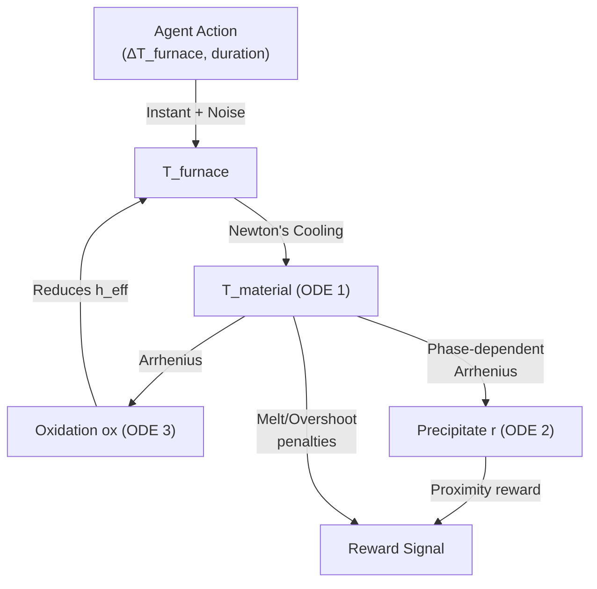

# ⚛️ Physics Engine

The Heat Treatment Digital Twin simulates precipitation hardening using three coupled Ordinary Differential Equations (ODEs), solved continuously by SciPy's `solve_ivp` (RK45, max step = 120 s). The state vector at every integration step is:

$$\mathbf{y} = [T_{mat},\; r,\; ox]$$

where $T_{mat}$ is the material core temperature (°C), $r$ is the precipitate radius (nm), and $ox$ is the oxidation insulation factor (dimensionless, 0-0.8).

---

## 1. Heat Transfer — Newton's Law of Cooling

The furnace air temperature ($T_{furnace}$) changes **instantaneously** when the agent selects a temperature action, plus Gaussian noise $\mathcal{N}(0, \sigma_T)$. But the material's core temperature follows Newton's Law of Cooling:

$$\frac{dT_{mat}}{dt} = \frac{h_{eff}(t) A_{surface}}{m C_p} (T_{furnace} - T_{mat})$$

| Symbol | Meaning | Source |
|--------|---------|--------|
| $h_{eff}(t)$ | Effective heat transfer coefficient (W/m² K) | `base_h × (1 − ox)` — decays with oxidation |
| $A_{surface}$ | Billet surface area: $2\pi r_b(r_b + h_b)$ (m²) | Computed from `hardware.json` geometry |
| $m$ | Mass: $\rho \pi r_b^2 h_b$ (kg) | `density_g_cm3` × 1000 × volume |
| $C_p$ | Specific heat capacity (J/kg K) | `materials.json` -> `specific_heat_capacity` |

### Why This Matters

This ODE creates **thermal inertia** (lag). A massive casting ($50\text{cm} \times 200\text{cm}$) has orders-of-magnitude more thermal mass than a lab sample ($1\text{cm} \times 5\text{cm}$), so its core temperature takes far longer to equilibrate. The agent must learn **"Predictive Braking"** — cutting the furnace heat long before the material reaches the target temperature — to prevent residual heat from causing catastrophic damage.


*Figure 1: W&B trace ([Run f1xofkz9](https://wandb.ai/mukundnjoy-paypal/heat-treatment-grpo/runs/f1xofkz9?nw=nwusermukundnjoy)) showing the agent cutting the furnace temperature (blue line) long before the target radius is reached, allowing the material temperature to drift safely into the target zone.*

### Worked Example: Thermal Mass Comparison

Consider `Ti_6Al_4V` ($\rho = 4.43\text{ g/cm}^3$, $C_p = 526\text{ J/kg K}$) across two hardware setups:

| Property | `lab_scale` (1cm × 5cm) | `massive_casting` (50cm × 200cm) |
|----------|-------------------------|----------------------------------|
| Volume | $\pi \cdot 0.01^2 \cdot 0.05 = 1.57 \times 10^{-5}\text{ m}^3$ | $\pi \cdot 0.5^2 \cdot 2.0 = 1.571\text{ m}^3$ |
| Mass | $0.070\text{ kg}$ | $6{,}959\text{ kg}$ |
| Surface area | $0.00377\text{ m}^2$ | $7.854\text{ m}^2$ |
| $h_{eff} \cdot A / (m \cdot C_p)$ | $\approx 2.56\text{ s}^{-1}$ | $\approx 1.61 \times 10^{-4}\text{ s}^{-1}$ |
| **Thermal time constant** | **~0.4 s** (near-instant) | **~1.7 hours** (extremely sluggish) |

---

## 2. Dynamic Oxidation Kinetics — Arrhenius Insulation

As the material heats, a surface oxide layer builds up, reducing the effective heat transfer coefficient and acting as a thermal insulator. Oxidation follows Arrhenius kinetics:

$$\frac{d(ox)}{dt} = A_{ox} \exp\left(-\frac{E_{ox}}{R (T_{mat} + 273.15)}\right) (0.8 - ox)$$

| Symbol | Meaning | Source |
|--------|---------|--------|
| $A_{ox}$ | Pre-exponential factor for oxidation (1/s) | `materials.json` -> `A_ox` |
| $E_{ox}$ | Activation energy for oxidation (J/mol) | `materials.json` -> `E_ox` |
| $R$ | Universal gas constant = 8.314 J/(mol K) | Constant |
| $(0.8 - ox)$ | Saturation term — caps insulation at 80% | — |

### Saturation Behavior

- The $(0.8 - ox)$ term acts as a self-limiting brake. As the oxide layer thickens, its growth rate slows asymptotically toward zero.
- The effective heat transfer coefficient becomes: $h_{eff} = base\_h (1.0 - ox)$
- At maximum oxidation ($ox = 0.8$), only 20% of the original heat transfer remains.

---

## 3. Precipitate Growth — Arrhenius + Phase Thresholds

The base reaction rate $k(T)$ for precipitate growth is driven by the Arrhenius equation:

$$k(T) = A \exp\left(-\frac{E}{R (T_{mat} + 273.15)}\right)$$

### Phase-Dependent Growth Rate

The actual growth rate $dr/dt$ depends on the current thermal regime, defined relative to the alloy's melting temperature ($T_{melt}$):

| Phase | Temperature Range | Growth Rate ($dr/dt$) | Physics |
|-------|-------------------|----------------------|---------|
| **Frozen** | $T < 0.35T_{melt}$ | $0$ | Atomic diffusion is negligible. |
| **Controlled Growth** | $0.35T_{melt} \leq T \leq 0.68T_{melt}$ | $k(T)(1 - r/R_{max})$ | Diffusion-controlled growth. |
| **Ostwald Ripening** | $0.68T_{melt} < T \leq T_{melt}$ | $k(T)(r/R_{max})(1 - r/R_{max})$ | Grain coarsening. Failure mode. |
| **Melting** | $T > T_{melt}$ | $0$ | Crystalline structure dissolves. |

Where $R_{max}$ = `alloy.r_max_clip` — the physical ceiling radius for the alloy.

> **ODE Stability**: All state variables are clamped inside the derivative function ($r \in [0, R_{max}]$, $ox \in [0, 0.8]$) and after ODE integration. Additionally, if $r \geq R_{max}$, growth is forced to zero.

### The Natural "Parking Brake"

In the **Controlled Growth** phase, the saturation factor $(1 - r/R_{max})$ creates an emergent deceleration:

- When $r \ll R_{max}$: growth is fast $(dr/dt \approx k(T))$
- When $r \to R_{max}$: growth slows to near-zero $(dr/dt \to 0)$

---

## 4. Reward Model

The reward function shapes the agent's policy toward precision, efficiency, and safety. All server-side rewards are clamped to $[-500, +500]$.

### Per-Step Reward

At every step with duration $\Delta t$ seconds:

$$R_{step} = -0.1 |r - r_{target}| - 0.01 (r - r_{target})^2 - 0.001 T_{mat} \frac{\Delta t}{3600} - 0.00028 \Delta t$$

Additionally, if $T_{mat}$ exceeds $T_{melt} - 100$°C:

$$R_{step} -= (T_{mat} - T_{warning}) 0.05 \frac{\Delta t}{3600}$$

### Terminal Rewards

| Condition | Reward |
|-----------|--------|
| **Success** $(r_{min} \leq r \leq r_{max})$ | $+100 + 100 \exp\left(-\frac{(r - r_{target})^2}{10}\right)$ |
| **Over-coarsened** ($r > r_{max}$) | $-100$ |
| **Melted** ($T \geq T_{melt}$) | $-200$ |
| **Timed out / Other** | $-50$ |

### Warning Temperature Thresholds

The per-step penalty intensifies when $T_{mat}$ exceeds $T_{melt} - 100$°C. Computed per alloy:

| Alloy | $T_{melt}$ (°C) | $T_{warning}$ (°C) | Penalty kicks in at |
|-------|-----------------|---------------------|---------------------|
| Al-2024 | 502 | 402 | 80% of $T_{melt}$ |
| Mg AZ31B | 630 | 530 | 84% of $T_{melt}$ |
| Inconel 718 | 1336 | 1236 | 93% of $T_{melt}$ |
| Cantor Alloy | 1334 | 1234 | 93% of $T_{melt}$ |
| Steel 1095 | 1400 | 1300 | 93% of $T_{melt}$ |
| Ti-6Al-4V | 1600 | 1500 | 94% of $T_{melt}$ |

---

## 5. ODE Solver Integration

The three coupled ODEs are solved together by `scipy.integrate.solve_ivp`:

```python
solution = solve_ivp(
    fun=self._physics_derivatives,    # [dT/dt, dr/dt, d(ox)/dt]
    t_span=(t_current, t_current + duration_sec),
    y0=[T_material, radius, oxidation_factor],
    method='RK45',                    # Explicit Runge-Kutta order 5(4)
    max_step=120                      # Evaluate every 2 simulated minutes
)
```

---

## 6. Noise & Stochasticity

The furnace temperature includes additive Gaussian noise $\mathcal{N}(0, \sigma_T)$.

| `AgentGrade` | $\sigma_T$ |
|--------------|-----------|
| EASY | 1 °C |
| MEDIUM | 2 °C |
| HARD | 3 °C |

---

## Summary of Coupled Dynamics


